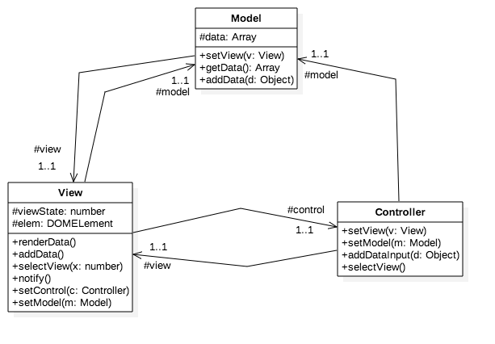
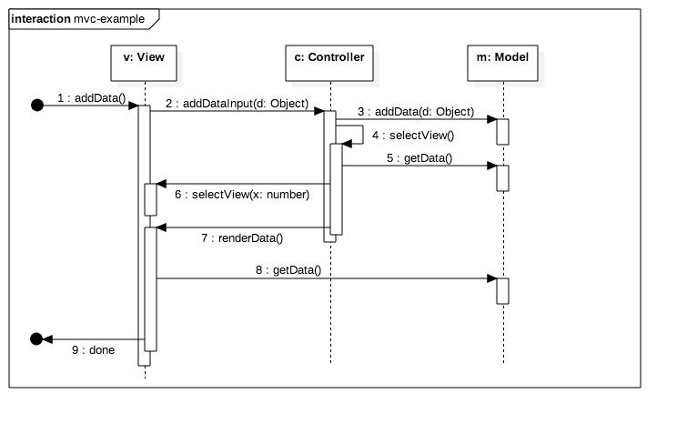

# MVC Code Example

Simple Model View Controller example. 

## Purpose

This simple web page presents data entered in two ways: 

* If the number of data elements entered by the user is less than or equal to 3 then the data is presented in a semi-colon list.  
* If the number of data elements entered by the user is greater than 3 then the data is present in a numbered list. 

## Usage

Simply open the index.html file in a web browser. No servers required! 

## Design

The following diagrams describe the application of the Model-View-Controller pattern. 

